<aside>
💡

# 빠른 결론!

- @Transactional 어노테이션을 사용하면 CGLIB가 타겟 클래스의 프록시 객체를 만들고 메서드를 실행하기 전 `TransactionInterceptor`
  에서 `TransactionManager`를 통해 트랜잭션 설정(AutoCommit false 등)과 커넥션 생성등의 작업을 실행해준다. 생성된
  커넥션은 `TransactionSynchronizationManager` 에 의해서 멀티 스레드 환경에서도 독립적으로 관리된다.
    - CGLIB가 타겟 클래스를 상속받은 프록시 객체를 만들고 메서드를 실행시켜준다.
        - 그렇기 때문에 private 메서드에는 @Transactional 사용이 불가능하다.
        - 또한, 같은 클래스 내부에서 다른 메서드를 호출할 때 @Transactional 사용이 불가능하다.
            - https://lob-dev.tistory.com/73
- 이후 데이터베이스에 접근하는 로직을 수행할 때 만들어진 커넥션을 획득해서 사용한다.
- 메서드의 실행이 원자성을 보장하도록 전체 커밋 or 롤백 해준다.

</aside>

# @Transactional을 사용하지 않는다면?

- 스프링은 객체를 그대로 빈으로 등록하여 사용한다.

# @Transactional을 사용한다면??

- 스프링은 객체의 프록시를 생성해 빈으로 등록하여 사용한다.

# 내부적으로 어떻게  구동되나?

## 1. `TransactionInterceptor`


- @Transactional 어노테이션이 붙은 메서드가 실행되면 트랜잭션 인터셉터의 invoke() 메서드가 호출되어 트랜잭션 준비를 시작한다.

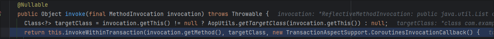

## 2. `TransactionAspectSupport`


<details>
<summary>invokeWithinTransaction()</summary>
<div markdown="1">

```Java
  @Nullable
  protected Object invokeWithinTransaction(Method method, @Nullable Class<?> targetClass, final InvocationCallback invocation) throws Throwable {
    TransactionAttributeSource tas = this.getTransactionAttributeSource();
    TransactionAttribute txAttr = tas != null ? tas.getTransactionAttribute(method, targetClass) : null;
    TransactionManager tm = this.determineTransactionManager(txAttr);
    if (this.reactiveAdapterRegistry != null && tm instanceof ReactiveTransactionManager rtm) {
      boolean isSuspendingFunction = KotlinDetector.isSuspendingFunction(method);
      boolean hasSuspendingFlowReturnType = isSuspendingFunction && "kotlinx.coroutines.flow.Flow".equals((new MethodParameter(method, -1)).getParameterType().getName());
      if (isSuspendingFunction && !(invocation instanceof CoroutinesInvocationCallback)) {
        throw new IllegalStateException("Coroutines invocation not supported: " + method);
      } else {
        CoroutinesInvocationCallback corInv = isSuspendingFunction ? (CoroutinesInvocationCallback)invocation : null;
        ReactiveTransactionSupport txSupport = (ReactiveTransactionSupport)this.transactionSupportCache.computeIfAbsent(method, (key) -> {
          Class<?> reactiveType = isSuspendingFunction ? (hasSuspendingFlowReturnType ? Flux.class : Mono.class) : method.getReturnType();
          ReactiveAdapter adapter = this.reactiveAdapterRegistry.getAdapter(reactiveType);
          if (adapter == null) {
            Class var10002 = method.getReturnType();
            throw new IllegalStateException("Cannot apply reactive transaction to non-reactive return type [" + var10002 + "] with specified transaction manager: " + tm);
          } else {
            return new ReactiveTransactionSupport(adapter);
          }
        });
        InvocationCallback callback = invocation;
        if (corInv != null) {
          callback = () -> {
            return TransactionAspectSupport.KotlinDelegate.invokeSuspendingFunction(method, corInv);
          };
        }

        return txSupport.invokeWithinTransaction(method, targetClass, callback, txAttr, rtm);
      }
    } else {
      PlatformTransactionManager ptm = this.asPlatformTransactionManager(tm);
      String joinpointIdentification = this.methodIdentification(method, targetClass, txAttr);
      if (txAttr != null && ptm instanceof CallbackPreferringPlatformTransactionManager cpptm) {
        ThrowableHolder throwableHolder = new ThrowableHolder();

        Object result;
        try {
          result = cpptm.execute(txAttr, (statusx) -> {
            TransactionInfo txInfo = this.prepareTransactionInfo(ptm, txAttr, joinpointIdentification, statusx);

            RuntimeException runtimeException;
            try {
              Object retVal = invocation.proceedWithInvocation();
              if (retVal != null && vavrPresent && TransactionAspectSupport.VavrDelegate.isVavrTry(retVal)) {
                retVal = TransactionAspectSupport.VavrDelegate.evaluateTryFailure(retVal, txAttr, statusx);
              }

              Object var15 = retVal;
              return var15;
            } catch (Throwable var13) {
              if (txAttr.rollbackOn(var13)) {
                if (var13 instanceof RuntimeException) {
                  runtimeException = (RuntimeException)var13;
                  throw runtimeException;
                }

                throw new ThrowableHolderException(var13);
              }

              throwableHolder.throwable = var13;
              runtimeException = null;
            } finally {
              this.cleanupTransactionInfo(txInfo);
            }

            return runtimeException;
          });
        } catch (ThrowableHolderException var24) {
          throw var24.getCause();
        } catch (TransactionSystemException var25) {
          if (throwableHolder.throwable != null) {
            this.logger.error("Application exception overridden by commit exception", throwableHolder.throwable);
            var25.initApplicationException(throwableHolder.throwable);
          }

          throw var25;
        } catch (Throwable var26) {
          if (throwableHolder.throwable != null) {
            this.logger.error("Application exception overridden by commit exception", throwableHolder.throwable);
          }

          throw var26;
        }

        if (throwableHolder.throwable != null) {
          throw throwableHolder.throwable;
        } else {
          return result;
        }
      } else {
        TransactionInfo txInfo = this.createTransactionIfNecessary(ptm, txAttr, joinpointIdentification);

        Object retVal;
        try {
          retVal = invocation.proceedWithInvocation();
        } catch (Throwable var22) {
          this.completeTransactionAfterThrowing(txInfo, var22);
          throw var22;
        } finally {
          this.cleanupTransactionInfo(txInfo);
        }

        if (retVal != null && txAttr != null) {
          TransactionStatus status = txInfo.getTransactionStatus();
          if (status != null) {
            label216: {
              if (retVal instanceof Future) {
                Future<?> future = (Future)retVal;
                if (future.isDone()) {
                  try {
                    future.get();
                  } catch (ExecutionException var27) {
                    if (txAttr.rollbackOn(var27.getCause())) {
                      status.setRollbackOnly();
                    }
                  } catch (InterruptedException var28) {
                    Thread.currentThread().interrupt();
                  }
                  break label216;
                }
              }

              if (vavrPresent && TransactionAspectSupport.VavrDelegate.isVavrTry(retVal)) {
                retVal = TransactionAspectSupport.VavrDelegate.evaluateTryFailure(retVal, txAttr, status);
              }
            }
          }
        }

        this.commitTransactionAfterReturning(txInfo);
        return retVal;
      }
    }
  }
```

</div>
</details>

- 트랜잭션 매니저 등을 설정해준다.

  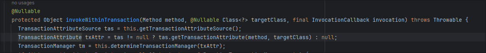

  ⇒ JpaTransactionManager가 주입된다.

  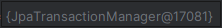


- 트랜잭션을 시작하기 위해 트랜잭션 정보를 가져온다.

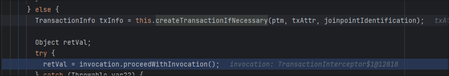

- 트랜잭션 매니저를 통해 트랜잭션을 가져온다.

<details>
<summary>createTransactionIfNecessary()</summary>
<div markdown="1">

```Java
  protected TransactionInfo createTransactionIfNecessary(@Nullable PlatformTransactionManager tm, @Nullable TransactionAttribute txAttr, final String joinpointIdentification) {
    if (txAttr != null && ((TransactionAttribute)txAttr).getName() == null) {
      txAttr = new DelegatingTransactionAttribute((TransactionAttribute)txAttr) {
        public String getName() {
          return joinpointIdentification;
        }
      };
    }

    TransactionStatus status = null;
    if (txAttr != null) {
      if (tm != null) {
        status = tm.getTransaction((TransactionDefinition)txAttr);
      } else if (this.logger.isDebugEnabled()) {
        this.logger.debug("Skipping transactional joinpoint [" + joinpointIdentification + "] because no transaction manager has been configured");
      }
    }

    return this.prepareTransactionInfo(tm, (TransactionAttribute)txAttr, joinpointIdentification, status);
  }
```

</div>
</details>

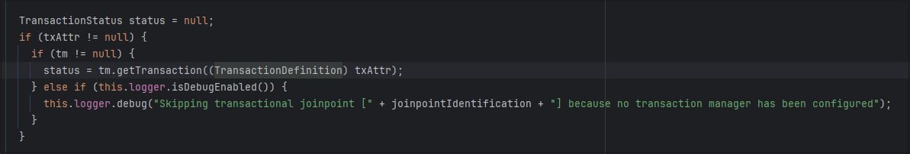

## 3. `AbstractPlatformTransactionManager`

- 구현체에 구현된 트랜잭션 가져오기

<details>
<summary>getTransaction()</summary>
<div markdown="1">

```Java
  public final TransactionStatus getTransaction(@Nullable TransactionDefinition definition) throws TransactionException {
    TransactionDefinition def = definition != null ? definition : TransactionDefinition.withDefaults();
    Object transaction = this.doGetTransaction();
    boolean debugEnabled = this.logger.isDebugEnabled();
    if (this.isExistingTransaction(transaction)) {
      return this.handleExistingTransaction(def, transaction, debugEnabled);
    } else if (def.getTimeout() < -1) {
      throw new InvalidTimeoutException("Invalid transaction timeout", def.getTimeout());
    } else if (def.getPropagationBehavior() == 2) {
      throw new IllegalTransactionStateException("No existing transaction found for transaction marked with propagation 'mandatory'");
    } else if (def.getPropagationBehavior() != 0 && def.getPropagationBehavior() != 3 && def.getPropagationBehavior() != 6) {
      if (def.getIsolationLevel() != -1 && this.logger.isWarnEnabled()) {
        this.logger.warn("Custom isolation level specified but no actual transaction initiated; isolation level will effectively be ignored: " + def);
      }

      boolean newSynchronization = this.getTransactionSynchronization() == 0;
      return this.prepareTransactionStatus(def, (Object)null, true, newSynchronization, debugEnabled, (Object)null);
    } else {
      SuspendedResourcesHolder suspendedResources = this.suspend((Object)null);
      if (debugEnabled) {
        Log var10000 = this.logger;
        String var10001 = def.getName();
        var10000.debug("Creating new transaction with name [" + var10001 + "]: " + def);
      }

      try {
        return this.startTransaction(def, transaction, false, debugEnabled, suspendedResources);
      } catch (Error | RuntimeException var7) {
        this.resume((Object)null, suspendedResources);
        throw var7;
      }
    }
  }

```

</div>
</details>

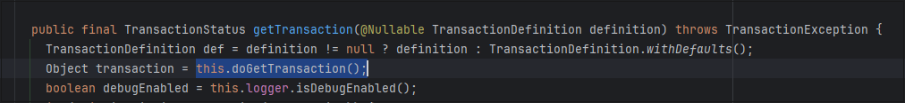

## 4. `JpaTransactionManager`

- `AbstractPlatformTransactionManager` 의 구현체

- 데이터 소스를 통해 커넥션 생성

<details>
<summary>doGetTransaction()</summary>
<div markdown="1">

```Java
  protected Object doGetTransaction() {
    JpaTransactionObject txObject = new JpaTransactionObject();
    txObject.setSavepointAllowed(this.isNestedTransactionAllowed());
    EntityManagerHolder emHolder = (EntityManagerHolder)TransactionSynchronizationManager.getResource(this.obtainEntityManagerFactory());
    if (emHolder != null) {
      if (this.logger.isDebugEnabled()) {
        this.logger.debug("Found thread-bound EntityManager [" + emHolder.getEntityManager() + "] for JPA transaction");
      }

      txObject.setEntityManagerHolder(emHolder, false);
    }

    if (this.getDataSource() != null) {
      ConnectionHolder conHolder = (ConnectionHolder)TransactionSynchronizationManager.getResource(this.getDataSource());
      txObject.setConnectionHolder(conHolder);
    }

    return txObject;
  }
```

</div>
</details>

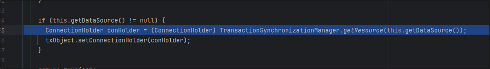

## 5. `AbstractPlatformTransactionManager`

- `getTransaction()`
- 트랜잭션 속성 정보를 바탕으로 트랜잭션 시작 준비

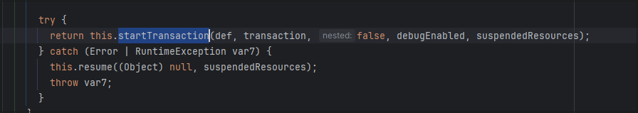

- 트랜잭션 시작

<details>
<summary>startTransaction()</summary>
<div markdown="1">

```Java
  private TransactionStatus startTransaction(TransactionDefinition definition, Object transaction, boolean nested, boolean debugEnabled, @Nullable SuspendedResourcesHolder suspendedResources) {
    boolean newSynchronization = this.getTransactionSynchronization() != 2;
    DefaultTransactionStatus status = this.newTransactionStatus(definition, transaction, true, newSynchronization, nested, debugEnabled, suspendedResources);
    this.transactionExecutionListeners.forEach((listener) -> {
      listener.beforeBegin(status);
    });

    try {
      this.doBegin(transaction, definition);
    } catch (Error | RuntimeException var9) {
      this.transactionExecutionListeners.forEach((listener) -> {
        listener.afterBegin(status, var9);
      });
      throw var9;
    }

    this.prepareSynchronization(status, definition);
    this.transactionExecutionListeners.forEach((listener) -> {
      listener.afterBegin(status, (Throwable)null);
    });
    return status;
  }
```

</div>
</details>

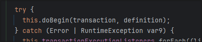

## 6. `JpaTransactionManager`

- 트랜잭션 시작 시 설정 추가

<details>
<summary>doBegin()</summary>
<div markdown="1">

```java
  protected void doBegin(Object transaction, TransactionDefinition definition) {
    JpaTransactionObject txObject = (JpaTransactionObject)transaction;
    if (txObject.hasConnectionHolder() && !txObject.getConnectionHolder().isSynchronizedWithTransaction()) {
      throw new IllegalTransactionStateException("Pre-bound JDBC Connection found! JpaTransactionManager does not support running within DataSourceTransactionManager if told to manage the DataSource itself. It is recommended to use a single JpaTransactionManager for all transactions on a single DataSource, no matter whether JPA or JDBC access.");
    } else {
      try {
        EntityManager em;
        if (!txObject.hasEntityManagerHolder() || txObject.getEntityManagerHolder().isSynchronizedWithTransaction()) {
          em = this.createEntityManagerForTransaction();
          if (this.logger.isDebugEnabled()) {
            this.logger.debug("Opened new EntityManager [" + em + "] for JPA transaction");
          }

          txObject.setEntityManagerHolder(new EntityManagerHolder(em), true);
        }

        em = txObject.getEntityManagerHolder().getEntityManager();
        int timeoutToUse = this.determineTimeout(definition);
        Object transactionData = this.getJpaDialect().beginTransaction(em, new JpaTransactionDefinition(definition, timeoutToUse, txObject.isNewEntityManagerHolder()));
        txObject.setTransactionData(transactionData);
        txObject.setReadOnly(definition.isReadOnly());
        if (timeoutToUse != -1) {
          txObject.getEntityManagerHolder().setTimeoutInSeconds(timeoutToUse);
        }

        if (this.getDataSource() != null) {
          ConnectionHandle conHandle = this.getJpaDialect().getJdbcConnection(em, definition.isReadOnly());
          if (conHandle != null) {
            ConnectionHolder conHolder = new ConnectionHolder(conHandle);
            if (timeoutToUse != -1) {
              conHolder.setTimeoutInSeconds(timeoutToUse);
            }

            if (this.logger.isDebugEnabled()) {
              this.logger.debug("Exposing JPA transaction as JDBC [" + conHandle + "]");
            }

            TransactionSynchronizationManager.bindResource(this.getDataSource(), conHolder);
            txObject.setConnectionHolder(conHolder);
          } else if (this.logger.isDebugEnabled()) {
            this.logger.debug("Not exposing JPA transaction [" + em + "] as JDBC transaction because JpaDialect [" + this.getJpaDialect() + "] does not support JDBC Connection retrieval");
          }
        }

        if (txObject.isNewEntityManagerHolder()) {
          TransactionSynchronizationManager.bindResource(this.obtainEntityManagerFactory(), txObject.getEntityManagerHolder());
        }

        txObject.getEntityManagerHolder().setSynchronizedWithTransaction(true);
      } catch (TransactionException var9) {
        this.closeEntityManagerAfterFailedBegin(txObject);
        throw var9;
      } catch (Throwable var10) {
        this.closeEntityManagerAfterFailedBegin(txObject);
        throw new CannotCreateTransactionException("Could not open JPA EntityManager for transaction", var10);
      }
    }
  }

```

</div>
</details>

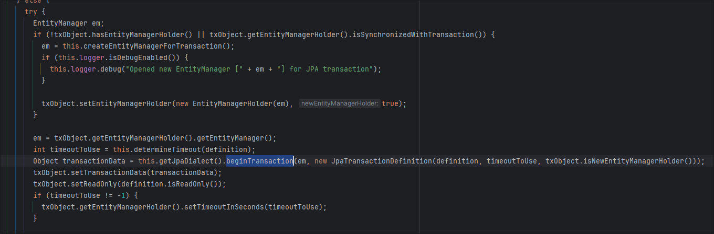

## 중간 생략

- 하이버네이트 등에서 설정 해주는 과정

## 7. `AbstractLogicalConnectionImplementor`

- AutoCommit을 false로 설정

<details>
<summary>begin()</summary>
<div markdown="1">


```java
  public void begin() {
    try {
      if (!this.doConnectionsFromProviderHaveAutoCommitDisabled()) {
        log.trace("Preparing to begin transaction via JDBC Connection.setAutoCommit(false)");
        this.getConnectionForTransactionManagement().setAutoCommit(false);
        log.trace("Transaction begun via JDBC Connection.setAutoCommit(false)");
      }

      this.status = TransactionStatus.ACTIVE;
    } catch (SQLException var2) {
      throw new TransactionException("JDBC begin transaction failed: ", var2);
    }
  }
```

</div>
</details>

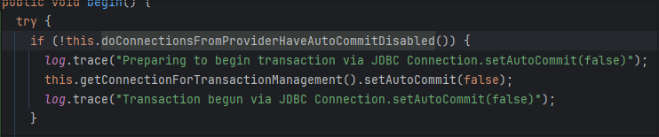

## 8. `JpaTransactionManager`

- 트랜잭션 동기화 매니저에 커넥션 저장
    - 트랜잭션이 진행되는 동안 동일한 커넥션을 하나의 스레드에서 일관되게 사용하도록 보당하기 위한 과정
    - `doBegin()` 일부

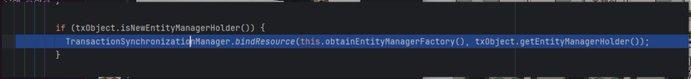

## 9. `TransactionAspectSupport`

- 실제 타겟 메서드 호출

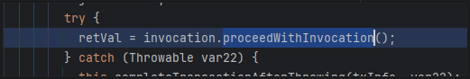

# @Transactional 내부 처리 과정


- @Transactional 어노테이션이 붙은 메서드가 호출된다.
- AOP 프록시가 호출된다.
- 트랜잭션 인터셉터를 통해 트랜잭션 처리 로직이 실행된다.
- 트랜잭션 매니저를 결정한다.
- 트랜잭션 매니저를 통해 커넥션을 생성한다.
- 커넥션을 생성할 때 AutoCommit을 false로 설정하는 등의 트랜잭션 설정 작업을 진행한다.
- 생성된 커넥션을 트랜잭션 동기화 매니저를 통해 보관한다.
- @Transactional 어노테이션이 붙어있던 실제 메서드를 호출한다.
- 리포지토리를 통해 데이터 베이스에 접근하는 로직을 요청한다.
- 트랜잭션 동기화 매니저를 통해 커넥션을 획득하여 원하는 로직을 수행한다.

# @Transactional 주의 사항

- AOP 프록시를 거쳐 실행됨을 명시하자.

### 같은 클래스 내에서 메서드 간 호출은 프록시를 거치지 않기 때문에 트랜잭션이 적용되지 않는다!!!!

```java
@Service
public class exampleService {

  public void external() {
    log.info("call external");
    logTransactionStatus();
    internal();
  }

  @Transactional
  public void internal() {
    log.info("call internal");
    logTransactionStatus();
  }

  private void logTransactionStatus() {
    // 트랜잭션 status 로그 출력
  }
}
```

⇒ `internal()`에서 트랜잭션 적용 XX

- 해결 방법
    - 클래스 분리

### private 메서드에 적용할 수 없다!!!

- CGLIB를 통해 타겟읜 클래스를 상속받은 프록시 객체를 생성하게 되는데
- private은 상속받은 하위 클래스에서 접근할 수 없어 적용되지 않는다.

# @Transactional 테스트

- 롤백 테스트
    - 테스트 후 트랜잭션을 자동으로 롤백하여 데이터베이스의 상태를 유지하고, 테스트 간 데이터 충돌을 방지하는 방식
    - 데이터베이스의 초기화 작업이 필요 없다.
    - 직접 초기화 하는 것 보다 성능이 빠르다.
- 주의할 점
    - 테스트 메서드에 @Transactional을 붙여 사용할 때, 실제 사용 메서드에 @Transactional이 붙어있지 않더라도 트랜잭션이 적용될 수 있다.
        - 실제 사용 케이스에서는 정상 작동되지 않을 수 있다!!

# 트랜잭션 속성

- Propagation
- Isolation
- read-only
- timeout
- rollback-for
- no-rollback-for

## Propagation 전파

- 트랜잭션을 시작하거나 기존 트랜잭션에 참여하는 방법을 결정하는 속성

### REQUIRED

- 기본 속성
- 있으면 참여, 없으면 새로 시작

### REQUIRES_NEW

- 항상 새로운 트랜잭션을 시작
- 진행 중인 트랜잭션이 있다면 잠시 보류시킴

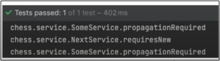

### SUPPORTS

- 이미 트랜잭션이 있으면 참여
- 그렇지 않으면 트랜잭션 없이 진행

### NESTED

- 이미 진행 중인 트랜잭션이 있으면 중첩 트랜잭션 시작
- 부모 트랜잭션 커밋, 롤백엔 영향을 받음
- 자신의 커밋, 롤백은 부모에 영향을 줄 수 없음

### NEVER

- 트랜잭션을 사용하지 않게 한다.
- 존재하면 예외 발생

### NOT_SUPPORTED

- 트랜잭션을 사용하지 않게 한다.
- 존재하면 보류

## Isolation 격리

- 여러 트랜잭션이 진행될 때에 트랜잭션의 작업 결과를 타 트랜잭션에게 어떻게 노출할 지 결정

### DEFAULT

- 사용하는 데이터 접근 기술, DB 드라이버의 기본 설정
    - Oracle은 READ_COMMITED
    - Mysql은 REPEATABLE_READ

### READ_UNCOMMITED

- 커밋되지 않은 데이터를 노출시킴
    - 데이터의 정합성은 떨어지지만
    - 성능이 좋음

### READ_COMMITED

- 다른 트랜잭션이 커밋하지 않은 정보를 조회할 수 없음
    - 읽는 시점에 따라서 데이터가 변경될 수 있음.

### REPEATABLE_READ

- 다른 트랜잭션이 읽은 정보를 수정(변경)할 수 없음
    - 트랜잭션 내에서는 스냅샷 데이터를 사용하기 때문에 독립적이다.

### SERIALIZABLE

- 트랜잭션을 순차적으로 진행시킴
    - 극단적으로 안전한 작업이 필요할 때 사용

## Timeout

- 트랜잭션을 수행하는 제한 시간을 설정할 수 있음
- 기본 옵션에는 제한시간이 없음

## ReadOnly

- 트랜잭션 내에서 데이터를 조작하려는 시도를 막음
- 데이터 접근 기술, 사용 DB에 따라서 적용 차이가 있음
    - 이 옵션을 켜더라도 데이터 조작 시 예외가 발생되지 않을 수도 있음
- 트랜잭션 id 관련 설정에서 오버헤드를 줄여 읽기 행동 시 참조하는 데이터 구조를 감소시키면서 성능이 증가될 수 있다.

## Rollback-for

- 기본적으로 RuntimeException 시 롤백
- 체크 예외지만 롤백 대상으로 삼고 싶다면 사용

## No-rollback-for

- 롤백 대상인 RuntimeException을 커밋 대상으로 지정

# Reference

https://www.youtube.com/watch?v=cc4M-GS9DoY

https://www.youtube.com/watch?v=XJo5O6GrFC0

https://www.maeil-mail.kr/question/181