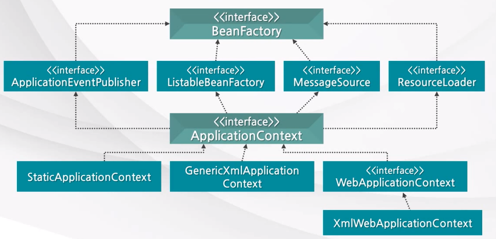

# Spring IoC Container?

- 스프링 빈으로 등록된 객체에 의존성을 주입하여 생성하고 관리하는 역할을 하는 객체입니다.

## 스프링 빈이란?

- Spring IoC Container(스프링 컨테이너)가 관리하는 객체를 의미합니다.
- 스프링 컨테이너에 의해서 생명 주기가 관리되며, 스프링 컨테이너를 통해 의존성을 주입받습니다.

## 스프링 컨테이너의 역할은?

- 애플리케이션의 설정 정보를 바탕으로 스프링 빈을 생성하고, 이들의 의존 관계를 주입하는 역할을 하며 생명 주기를 관리합니다.

### BeanFactory

- 빈을 생성하고 분배하는 책임을 지는 객체입니다.
    - 빈의 등록, 생성, 조회, 반환 관리를 수행합니다.
        - 빈을 조회할 수 있는 getBean() 메서드가 정의되어 있습니다.

### ApplicationContext

- 대부분의 애플리케이션에서 사용하는 컨테이너 인터페이스입니다.
- BeanFactory를 상속한 객체로 국제화 메시지 및 이벤트 발행 등 여러 인터페이스를 상속하여 추가적인 기능을 제공합니다.

## 그렇다면 스프링 컨테이너는 어떤 과정으로 빈을 생성하여 관리할까? (간단하게!)

### 빈 등록

- XML 작성을 통한 등록 방식… (Spring Framework 때의 방식으로 현재는 잘 사용하지 않음)
- Java Configuration
    - @Configuration 어노테이션이 붙은 설정 클래스에 빈으로 등록하는 방법입니다.
    - 특정 상황에서는 사용하지만, 수동으로 등록해야 하므로 생산성이 낮습니다.
- **Component Scan**
    - @Component 어노테이션이 붙은 클래스를 탐색하여 빈으로 등록해줍니다.
    - @ComponentScan 어노테이션을 통해 스캔할 범위를 설정할 수 있습니다.

### 빈 스코프

- 스프링 컨테이너가 등록된 빈을 관리하는 방법
- **Singleton**
    - 객체의 인스턴스가 오직 한 개만 생성되는 것을 보장하는 디자인 패턴입니다.
    - 주의점!!
        - 객체의 상태를 유지하게 설계하면 안됩니다. (무조건 Stateless!!!)
            - 여러 스레드에 걸쳐 싱글톤으로 생성된 객체가 사용될 때 상태 값이 예상치 못한 값으로 변경될 수 있습니다.
- **Prototype**
    - 항상 새로운 스프링 빈을 생성하여 의존관계 주입 및 초기화를 진행한다.
    - Stateful하도록 상태 값을 갖는 객체를 빈으로 생성할 때 사용할 수 있다.
- 웹 관련 스코프
    - Request
        - 웹 요청이 들어오고 나갈 때까지 유지되는 설정입니다.
    - Session
        - 웹 세션이 생성되고 종료될 때까지 유지되는 설정입니다.
    - Application
        - 웹의 서블릿 컨텍스트와 같은 범위로 유지되는 설정입니다.

### 빈 라이프 사이클

- **Singleton Bean**
    - 스프링 컨테이너와 동일한 생명 주기를 갖습니다.
- **Prototype Bean**
    - 클라이언트에서 스프링 컨테이너에 프로토타입의 빈을 요청했을 때 의존관계를 주입해서 생성됩니다.
    - 스프링 컨테이너는 빈 생성, 의존관계 주입, 초기화만을 수행하며, 이후 소멸등의 관리는 모두 클라이언트에서 자체적으로 해야합니다.

## 싱글톤 빈에서 프로토타입 빈을 주입받는다면???

- 싱글톤 특성 상 하나의 프로토타입 빈을 주입받아 모든 스레드에서 사용하게 된다.
- 싱글톤 빈을 스프링 컨테이너에게 요청해서 받아올 때 항상 새로운 프로토타입 빈을 주입받을 필요가 있다.
    - 스프링 컨테이너의 DL(Dependency Lookup) 기능을 사용해서 해결할 수 있다!

### 스프링 컨테이너의 DL??

- 개발자가 필요한 시점에 의존성을 요청하여 컨테이너로부터 해당 의존성을 가져오는 것을 말합니다.
- ObjectFactory를 상속받아 구현한 ObjectProvider를 통해서 개발자가 지정한 클래스 타입의 빈을 컨텍스트에서 조회할 수 있습니다.
- 추가적인 내용은 다음 시간에…!

## 빈이 의존성을 주입 받는 방법은?

- **생성자 주입**
- 필드 주입
    - 단점
        - 외부에서 변경이 어렵다.
        - 프레임워크에 의존적이고 객체지향적이지 않다.
- 수정자 주입
    - 단점
        - 수정자(setter)를 public으로 열어두어야 하므로 어디서든 변경이 가능해진다.

### 생성자 주입!

- 순환 참조를 방지할 수 있다.
    - 구동 시점에서 `BeanCurrentlyInCreationException` 이 발생되어 파악할 수 있다.
- 불변성을 활용할 수 있다.
    - final 객체로 필드에 선언한 후 생성자로 주입받아 사용할 수 있다.
- 테스트에 용이하다.
    - DI 컨테이너 없이도 의존성을 주입하여 사용할 수 있다.

# Reference

https://f-lab.kr/insight/understanding-spring-container-and-beans?gad_source=1&gclid=Cj0KCQiA8q--BhDiARIsAP9tKI1lUDAiaOd-gYJQbuy_RX0ZwCLL9vrMmVrRIkzrhk3JeOlKjfa6th0aAj6_EALw_wcB

https://www.youtube.com/watch?v=UcpLNgko8lg&t=81s

https://www.youtube.com/watch?v=3gURJvJw_T4&t=311s

https://catsbi.oopy.io/b2de2693-fd8c-46e3-908a-188b3dd961f3

https://dev-coco.tistory.com/70

- DL 추가 학습
    
    https://ones1kk.tistory.com/entry/Spring-DLDependency-Lookup
