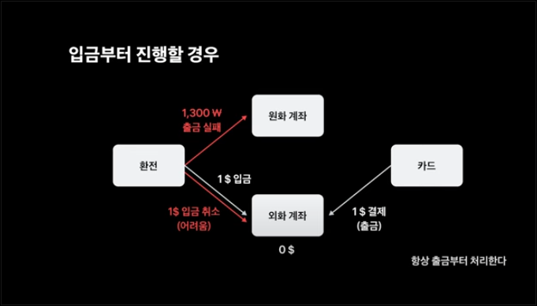

# SAGA 패턴 심화 질문!

## 전제 조건

- (A 서비스 → B 서비스 → C 서비스) 순서로 분산 트랜잭션을 유지해야 합니다.

## Q. Orchestration SAGA 패턴을 적용한 아키텍처에서 Gateway는 어떤 엔드포인트로 요청을 전송해야 하는가?!

- 내가 궁금한 점
    - A 서비스에서 시작하는 A 서비스와 관련된 어떠한 로직인데 Orchestrator에게 요청이 간다면 혼동이 생기지 않을까?
    - 여러 서비스가 필요한 로직들이 많아지면 Orchestrator는 너무 많은 비즈니스 로직을 포함하게 되는 것이 아닌가?

### A. Orchestrator(Coordinator)로 요청이 가야합니다!

- 분산 트랜잭션의 관리 주체를 Orchestrator로 하여 모든 보상 트랜잭션을 수행할 수 있습니다.
- 만약 너무 복잡해진다면, Orchestration이 아닌 Coreography 방식을 사용할 수 있습니다.
    - 특정 도메인 서비스에서 분산 트랜잭션을 관리하는 방식의 SAGA 패턴입니다.
- 특정 도메인(금융 결제, 거래 실패, 예약 실패, …)에서는 분산 환경이지만 동기적인 처리가 꼭 필요할 수 있습니다.
    - 이런 상황에서 Orchestration 방식을 사용하여 트랜잭션이 유지되는 하나의 로직으로써 구현할 수 있습니다.
- 하지만 또다른 도메인(전자상거래 결제, …)에서는 독립적으로 관리될 수 있는 분산 서비스에 대해서 비동기로 처리하며 분산 트랜잭션을 관리할 수 있습니다.
- 또한, MSA의 규모에 따라서 사용이 구분될 수 있습니다.
    - 규모가 작다면 하나의 팀으로 여러 분산 시스템을 관리하므로 Orchestration이 적합할 수 있습니다.
    - 반대로 규모가 크다면 도메인을 기준으로 여러 팀으로 나눠지므로 Coreography가 적합할 수 있습니다.
- 만약 비즈니스 도메인의 역할이 매우 높다면, Coreography를 기본으로 사용하고 Orchestration을 활용하여 전반적인 트랜잭션을 모니터링할 수 있습니다.

## Q. 분산 트랜잭션을 수행하는 중에 락이 필요하다면 어떠한 주체가 락을 수행해야 하는가?

- 내가 궁금한 점
    - 토스에서는 위 사진처럼 발생될 수 있는 문제를 “항상 출금부터 처리한다”는 말처럼 비즈니스 로직으로 강제해서 해결했습니다.
    - 만약 이렇게 비즈니스 로직으로 강제하지 않는다면 어떻게 해당 문제를 해결할 수 있을까요?
    - 이러한 문제는 분산 트랜잭션을 수행하면서 일부 데이터베이스를 대상으로 락을 걸어줘야 하지 않을까 싶습니다!

### A. 트랜잭션의 주체가 락을 수행하도록 해야합니다!

- Orchestration/Coreography 방식의 SAGA 패턴을 사용한다면, 분산 트랜잭션의 주체인 곳에서 비관적/낙관적 락을 수행할 수 있도록 조치해야 합니다!
- 하지만!!! 무조건 특정 기술로 해결하는 것이 정답이 될 수는 없습니다.
    - 더 다양한 해결책을 모색하여 도메인 서비스에 적합한 해결책을 찾을 수 있도록 노력합시다!

[토스ㅣSLASH 24 - 보상 트랜잭션으로 분산 환경에서도 안전하게 환전하기](https://www.youtube.com/watch?v=xpwRTu47fqY&t=771s)

 
 

# 대규모 스트림 처리 강의 수강

[대규모 스트림 처리 1주차 노션 필기](https://iamjeonjuho.notion.site/1-1b123a51a48380dba1e9ed53509d9750?pvs=4)

